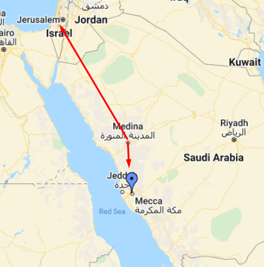

*Date: 25-04-2022*
**Ayat 142 - 147**
# Ruku 17

## Overview
Second Juz Begins!
This Ruku deals with the directon of Qibla where Muslims offer their prayers.

Ayat 142:
- `The block-headed will say:`
  - `“What has turned them away from the direction they formerly observed in Prayer?”`
  - Tahfium-ul-Quran:
    - After his migration to Madina the Prophet continued to pray in the direction of Jerusalem for between sixteen and seventeen months. Subsequently, he received the order to pray in the direction of the Ka'bah. See( verse 144 below)
- `Say: `
  - `“To Allah belong the East and the West; He guides whomsoever He wills onto a Straight Way.”`
    - Tahfium-ul-Quran:
      - This is the first answer to the objections of these ignorant people. Their narrow minds and limited vision led them to undue attachment to such formalities as the direction and locale of Prayer. 
      - They presumably conceived God to be confined to a particular direction. 
      - In reply to their absurd objection the first thing which was explained was that all directions belong to God. 
      - Fixing any particular direction for Prayer does not mean that God is confined to that direction. 
      - All those who have been favoured with God's true guidance rise above such limitations of outlook so that it is easy for them to grasp the universal verities of religion. (See also (nn. 115 and 116 above.)

Ayat 143:
- `And it is thus that We appointed you to be the community of the middle way `
- `so that you might be witnesses to all mankind `
- `and the Messenger might be a witness to you.`
  - Tahfim-ul-Quran:
    - This constitutes the proclamation appointing the religious community (ummah) consisting of the followers of Muhammad to religious guidance and leadership of the world. 
    - ' And it is thus', which precedes this proclamation, contains two allusions.
    -  It alludes, in the first place, to that Divine Guidance which enabled the followers of Muhammad to know the Straight Way so that they could attain progress to the point of being proclaimed 'the community of the middle way' (or 'the mid-most community' or 'the community justly balanced' - Ed.) 
    -  In the second place there is an allusion to the change in the direction of Prayer from Jerusalem to the Ka'bah. 
    -  People of limited intelligence could see no significance in this change of direction although the substitution of Jerusalem by the Ka'bah amounted to the **removal of the Children of Israel from their position of world leadership and their replacement by the ummah of Muhammad (peace be on him)**. 
    -  The Arabic expression which we have translated as 'the community of the middle way' is too rich in meaning to find an adequate equivalent in any other language. 
    -  It signifies that distinguished group of people which follows the path of justice and equity, of balance and moderation, a group which occupies a central position among the nations of the world so that its friendship with all is based on righteousness and justice and none receives its support in wrong and injustice. 
    -  The purpose of creating 'the community of the middle way', according to this Qur'anic verse, is to make it stand as witness 'before all mankind and the Messenger might be a witness before you'. 
    -  What this means is that when the whole of mankind is called to account, the Prophet, as God's representative, will stand witness to the fact that he had communicated to the Muslims and had put into practice the teachings postulating sound beliefs, righteous conduct and a balanced system of life which he had received from on high. 
    -  *The Muslims, acting on behalf of the Prophet after his return to the mercy of God, will he asked to bear the same witness before the rest of mankind and to say that they had spared no effort in either communicating to mankind what the Prophet had communicated to them, or in exemplifying in their own lives what the Prophet had, by his own conduct, translated into actual practice.*
    -  This position of standing witness before all mankind on behalf of God, which has been conferred on this community, amounts to its being invested with the leadership of all mankind. This is at once a great honour and a heavy responsibility. 
    -  For what it actually means is that just as the Prophet served as a living example of godliness and moral rectitude, of equity and fair play before the Muslim community, 
    -  so is the Muslim community required to stand vis-à-vis the whole world. What is expected of this community is that it should be able to make known, both by word and deed, the meaning of godliness and righteousness, of equity and fairplay. 
    -  Furthermore. just as the Prophet had been entrusted with the heavy responsibility of conveying to the Muslims the guidance which he had received. in a like manner *a heavy responsibility has been laid on the Muslims to communicate this guidance to all mankind.*
    -   If the Muslims fail to establish before God that they did their duty in conveying to mankind the guidance they had received through the Prophet they will be taken to task seriously and their honourable position as the leaders of the whole world, far from being of any help to them, will spell their disaster. 
    -   They will be held responsible along with the protagonists of evil for all the errors of belief and conduct which have spread during their term of leadership. 
    -   **They will have to face the grim question: What were they doing when the world was convulsed by storms of transgression, injustice and error?**

- `We appointed the direction which you formerly observed so that We might distinguish those who follow the Messenger from those who turn on their heels.` 
  - Tahfim-ul-Quran:
    - One purpose of this change in the direction of Prayer was to find out who was blinkered by irrational prejudices and chained by chauvinistic attachment to land and blood, and who, having liberated himself from those bonds, was capable of rising to the heights and grasping the Truth. 
    - On the one hand were the Arabs who were steeped in their national and racial arrogance. For them, taking Jerusalem as the direction of their Prayer (as originally practised by the Prophet) was too hard a blow to their national vanity to be accepted with equanimity. 
    - On the other hand, the Jews were essentially no different. They, too, were obsessed with racial pride so that it was difficult for them to accept any other than the direction of Prayer which they had inherited from the past. 
    - How could the people whose hearts were full of such idols respond to the call of the Messenger of God? 
    - Hence, God saw to it that the worshippers of such idols were distinguished from the genuine worshippers of God by first fixing Jerusalem as the direction of Prayer. 
    - This was bound to alienate all those who had worshipped the idol of Arabianism. 
    - Later, the fixing of the Ka'bah as the direction of Prayer led to the alienation of those who were engrossed in the worship of the idol of Israel. Thus there were left with the Prophet only, those who truly worshipped none but the One True God.
    - Note: This is by far one of the most beatiful tafsir I have read which helped me easily understand the purpose of the direction, first towards Jerusalem then towards Ka'ba.
- `For it was indeed burdensome except for those whom Allah guided. `
- `And Allah will never leave your faith to waste. `
- `Allah is full of gentleness and mercy to mankind.`

Ayat 144:
- `We see you oft turning your face towards the sky; `
- `now We are turning you to the direction that will satisfy you. `
- `Turn your face towards the Holy Mosque, and wherever you are, turn your faces towards it in Prayer.`
  - Tahfim-ul-Quran:
    - This is the injunction concerning the change in the direction of Prayer and was revealed in Rajab or Sha'ban. 2 A.H. 
    - According to a Tradition in the Tabaqat of Ibn Sa'd, the Prophet was at the house of Bishr b. Bara'b. Ma'rur where he had been invited to a meal. 
    - When the time of zuhr prayer came, the Prophet rose to lead it. 
    - He had completed two rak'ahs and was in the third when this verse was suddenly revealed. 
    - Soon after the revelation of this verse everybody, following the leadership of the Prophet, turned the direction of Prayer away from Jerusalem to the Ka'bah. 
    - A public proclamation of the new order was then made throughout Madina and in the suburbs. 
    - Bara' b. 'Azib says that at one place the announcement was heard by people while they were in the state of ruku' (kneeling). 
    - On bearing this order they immediately turned their faces towards the Ka'bah. 
    - Anas b. Malik says that the news of the announcement reached Banu Salamah the next day while the morning Prayer was in progress. 
    - People had completed one rak'ah when they heard the announcement about the change of direction and the entire congregation immediately faced the new qiblah. (See Ibn Sa'd, Tabaqat, vol. 1, pp. 241 f. - Ed.) 
    - It ought to be noted that Jerusalem is to the north of Madina while the Ka'bah is to the south. 
    - In order to change direction during congregational Prayer it would have been necessary for the leader of the Prayer to walk several steps beyond what was originally the last row of worshippers. 
    - The people in the congregation, too, would have been forced not only to make a right about-turn but also to walk a little to straighten their rows. 
    - We find specific mention of this in certain Traditions. 
    - The words, `'We see you oft turning your face to the heaven'`, and `'Now We are turning your face to the direction that shall satisfy you'`, show clearly that even before the revelation of this injunction the Prophet was expecting something of this nature. 
    - He had begun to feel, with the termination of the era of Israelite leadership, that the time had come for the central position of Jerusalem to cease and a return to the original centre of the Abrahamic mission to commence.
    - The 'Holy Mosque' refers to the sanctuary invested with holiness and sanctity; 
    - the sanctuary in the centre of which the Ka'bah is located. 
    - To turn one's face in the direction of the Ka'bah does not mean that wherever a man might be he should turn to the Ka'bah with absolute accuracy. 
    - It would obviously be extremely difficult for everyone to comply with such an order. 
    - Hence the order is to turn one's face in the direction of the Ka'bah rather than to the Ka'bah itself. 
    - According to the Qur'an, we are required to find out the direction of the Ka'bah as accurately as possible. 
    - We are not required, however, to locate it with absolute precision. 
    - We may pray in the direction which appears correct as a result of our enquiry. 
    - However, if a man is either at a place where it is difficult to determine the direction of the Ka'bah or if he is in a position where it is difficult to maintain the correct direction (e.g. when travelling on a train, a boat, or an aeroplane),
    -  he may pray in the direction which seems correct, or in whatever direction it is possible for him to face. 
    -  If he then comes to know the correct direction while he is in the state of Prayer he should turn his face in that direction.

- `Those who have been granted the Scripture certainly know that this (injunction to change the direction of Prayer) is right and is from their Lord.` 
- `Allah is not heedless of what they do.`

Link: https://www.google.com/maps/d/u/0/viewer?msa=0&mid=1no4tePW4V_nqYYGRTI59GpHoKq4&ll=24.227969529940257%2C46.194231829864414&z=5

As per the above image, it'd mean that the Imam would have to go towards the back of the row and all of the rows would have to be (almost) reversed.

Ayat 145:
- `And yet no matter what proofs you bring before the People of the Book they will not follow your direction of Prayer;`
- `nor will you follow their direction of Prayer.`
  - This looks like a similar indication as provided in Surah Qafiroon.
- `None is prepared to follow the other’s direction of Prayer.`
- `Were you to follow their desires in disregard of the knowledge which has come to you,` 
- `you will surely be reckoned among the wrong-doers.`

Ayat 146:
- `Those to whom We have given the Scripture recognize the place (towards which one must turn in Prayer) as fully as they recognize their own sons,1`
  - This is just too powerful of a relevance! 
- `this even though a group of them knowingly conceals the Truth.`

Ayat 147:
- `This is a definite Truth from your Lord; `
- `be not, then, among the doubters.`